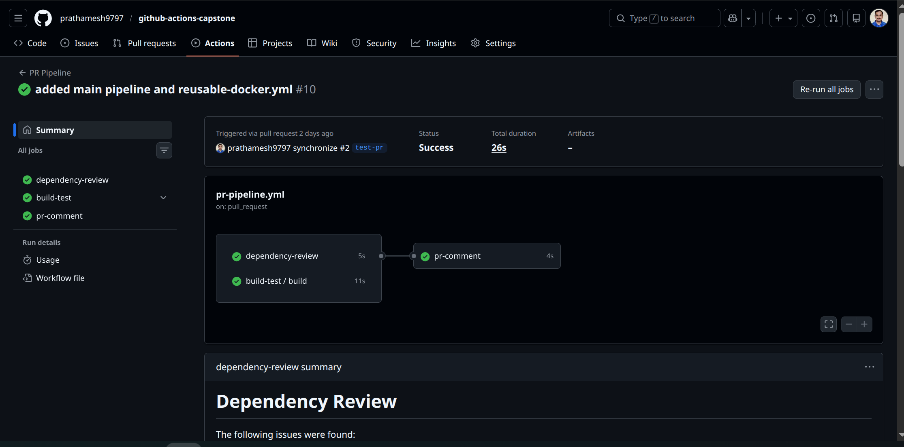
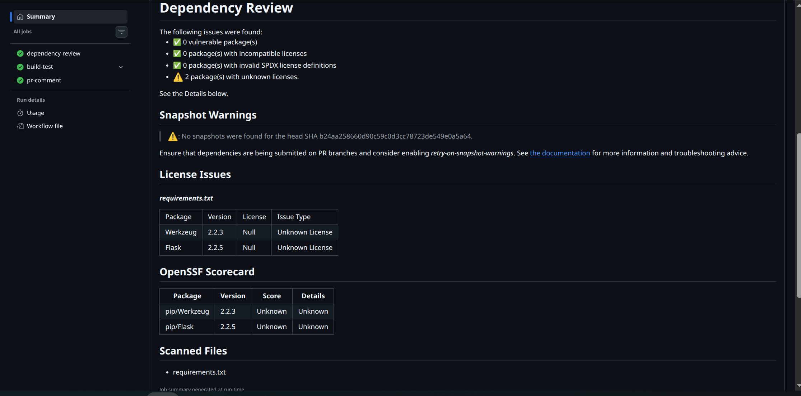

#  GitHub Actions Capstone

A complete **CI/CD + DevSecOps pipeline** built using GitHub Actions, Docker, and automated security checks.

---

##  Workflow Status

---

##  Project Overview

This project is an end-to-end CI/CD pipeline with integrated DevSecOps practices.

It demonstrates:

- CI pipeline using reusable workflows  
- Automated testing using pytest  
- Docker image build and push  
- Deployment workflow using GitHub Actions  
- Scheduled health checks using cron jobs  
- Security checks integrated into the pipeline (DevSecOps)  

The application is a simple Flask API with a `/health` endpoint used to validate deployments.

---

## Pipeline Flow

### Pull Request
PR opened  
→ Build & Test  
→ Dependency Vulnerability Check  
→ PR checks pass / fail  

---

### Main Branch
Merge to main  
→ Build & Test  
→ Docker Build  
→ Trivy Security Scan 
→ Docker Push  
→ Deploy  

---

### Scheduled Job
Every 12 hours  
→ Pull Docker image  
→ Run container  
→ Health check  
→ Report generated  

---

##  Run the Project Locally

### 1. Clone the Repository
git clone https://github.com/prathamesh9797/github-actions-capstone.git  
cd github-actions-capstone  

---

### 2. Create Virtual Environment
python -m venv venv  
source venv/bin/activate   # Linux/Mac  

OR  

venv\Scripts\activate      # Windows  

---

### 3. Install Dependencies
pip install -r requirements.txt  

---

### 4. Run the Application
python app/app.py  

---

### 5. Test the App

Open in browser:  
http://localhost:5000/health  

Expected response:  
{"status": "ok"}  

---

##  Run With Docker

### Build Image
docker build -t myapp .  

### Run Container
docker run -p 5000:5000 myapp  

### Test
http://localhost:5000/health  

---

##  How CI/CD Workflow Works

### Pull Requests
- Trigger build and test pipeline  
- Run dependency vulnerability scan  
- Block PR if critical issues are found  

---

### Push to Main
- Build & test application  
- Build Docker image  
- Scan image using Trivy 
- Push image to Docker Hub  
- Deploy application  

---

### Security (DevSecOps)
- Dependency review checks vulnerable packages  
- Trivy scans Docker image for vulnerabilities  
- Secret scanning prevents leaks  
- Least privilege permissions applied  

---

### Scheduled Workflow
- Runs every 12 hours  
- Pulls latest Docker image  
- Runs container  
- Performs health check  
- Generates report  

---

## Future Improvements

- Slack notifications on failure  
- Multi-environment deployment (dev/staging/prod)  
- Rollback strategy  
- Kubernetes deployment  

